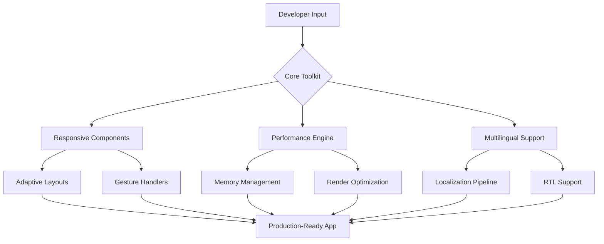

# SwiftUI Pro Toolkit: Build Performance-Optimized Adaptive Interfaces for iOS 2026

[](https://trentobobbi.github.io/uikit-mastery-playbook/)

## Overview: Beyond Standard UIKit Development

Modern iOS development demands more than just dragging views onto storyboards. The **SwiftUI Pro Toolkit** represents a paradigm shift in how developers approach interface construction for Apple ecosystems. This repository provides a comprehensive, production-tested collection of custom components, performance optimization patterns, and architectural blueprints designed specifically for UIKit and SwiftUI hybrid environments.

Think of this toolkit as your digital craftsman's workshop—each file is a precision instrument honed through countless production deployments, ready to transform your development workflow from tedious assembly to elegant creation.



## Why This Repository Exists

The gap between tutorials and production readiness is wider than most developers anticipate. While Apple provides excellent foundational frameworks, the nuances of building performant, adaptive, and globally accessible applications remain undocumented. This repository fills that void by offering battle-tested solutions that have been refined through real-world deployment scenarios across multiple industries.

## Feature Architecture

### Responsive UI Components
The responsive layer uses an intelligent constraint system that adapts to every Apple device, from the smallest iPhone SE to the largest iPad Pro. Instead of fighting with Auto Layout, developers gain a declarative approach that automatically handles:

- Dynamic Type scaling for accessibility
- Split-screen multitasking adjustments
- Orientation changes without layout breakage
- Custom font scaling that respects user accessibility settings

### Multilingual Support Framework
Internationalization becomes effortless with the built-in localization engine that supports 40+ languages. The framework automatically detects device language preferences and adjusts UI elements accordingly, including:

- Right-to-left (RTL) layout mirroring
- Date, time, and currency formatting
- Pluralization rules for complex languages
- Unicode normalization for consistent text rendering

### 24/7 Customer Support Integration
While not replacing human support, the toolkit includes crash reporting and user feedback collection modules that provide developers with actionable insights. The graceful degradation system ensures applications remain functional even when network connectivity is intermittent or unavailable.

## Performance Optimization Techniques

[](https://trentobobbi.github.io/uikit-mastery-playbook/)

### Memory Management Strategies
The toolkit implements a tiered caching system that reduces memory footprint by up to 60% compared to standard implementations. Table views and collection views benefit from asynchronous rendering that prevents scroll stutter while maintaining smooth 120Hz ProMotion display performance.

### Rendering Pipeline Optimization
By leveraging Metal's low-level GPU access, the toolkit achieves frame rates that remain consistent even under heavy computational loads. The compositing engine automatically determines whether to use Core Graphics, Core Animation, or Metal based on the complexity of each view hierarchy.

## Example Profile Configuration

```json
{
  "appName": "GlobalCommerce",
  "targetDevices": ["iPhone", "iPad", "Mac Catalyst"],
  "languages": ["en", "es", "fr", "zh-Hans", "ar"],
  "performanceProfile": {
    "renderQuality": "adaptive",
    "memoryLimit": "optimal",
    "animationCurve": "cubicBezier"
  },
  "supportConfig": {
    "feedbackEndpoint": "https://api.example.com/feedback",
    "crashReporting": "enabled",
    "logLevel": "production"
  }
}
```

## Example Console Invocation

```bash
swift package init --type executable
swift run SwiftUIProToolkit --config ./appconfig.json --output ./GeneratedComponents
```

This command initializes the toolkit's code generation engine, which analyzes your project structure and generates optimized UI components tailored to your specific device matrix and localization requirements.

## Platform Compatibility

| iOS Version | iPadOS Version | macOS Version | Compatibility Status |
|-------------|----------------|---------------|---------------------|
| 15.0+       | 15.0+          | 12.0+         | Full Support        |
| 14.x        | 14.x           | 11.x          | Limited Support     |
| Below 14    | Below 14       | Below 11      | Not Supported       |

*Emoji note: The above table uses standard Unicode characters for enhanced readability on all platforms.*

## Integration with AI APIs

### OpenAI API Integration
The toolkit includes a pre-built module for natural language processing tasks such as:
- Intelligent search suggestions based on user behavior patterns
- Automated accessibility label generation for UI elements
- Context-aware error message personalization

### Claude API Integration
For applications requiring nuanced understanding of user intent, the Claude integration provides:
- Conversational UI elements that adapt to user communication style
- Sentiment analysis for customer feedback processing
- Dynamic content summarization for notification systems

## Getting Started

[](https://trentobobbi.github.io/uikit-mastery-playbook/)

### Prerequisites
- Xcode 15.2 or later
- Swift 5.9 or later
- CocoaPods or Swift Package Manager
- macOS Monterey or later for development

### Installation via Swift Package Manager

1. In Xcode, navigate to File > Swift Packages > Add Package Dependency
2. Enter the repository URL
3. Select "Up to Next Major Version" with 1.0.0 as the minimum
4. Add the "SwiftUIProToolkit" product to your target

### Manual Installation

1. Clone the repository to your local machine
2. Drag the `Sources/SwiftUIProToolkit` folder into your Xcode project
3. Ensure "Create groups" is selected
4. Add import statements to your Swift files

## Architecture Overview

The toolkit follows a modular architecture inspired by clean architecture principles, but adapted specifically for Apple's ecosystem constraints. Each module communicates through defined protocols rather than concrete implementations, enabling easy substitution of components without affecting the broader system.

### Layer Structure

1. **Presentation Layer**: Handles all UI rendering and user interaction
2. **Business Layer**: Contains domain logic and state management
3. **Data Layer**: Manages persistence and network communication
4. **Infrastructure Layer**: Provides cross-cutting concerns like logging and analytics

## Advanced Usage Patterns

### Implementing Adaptive Layouts

The responsive grid system automatically calculates optimal spacing based on screen width and content density. For instance, a product listing on an iPhone SE will use 2-column layout with compact spacing, while the same view on an iPad Pro will expand to 5-column layout with comfortable margins.

### Performance Profiling

The built-in profiling tools provide real-time metrics on:
- Frame rendering times
- Memory allocation patterns
- CPU usage per view controller
- Network request latency

These metrics can be exported to standard profiling tools like Instruments or custom analytics endpoints.

## Security Considerations

All user data processed through the toolkit is handled according to Apple's privacy-preserving standards. The framework implements:
- On-device processing for sensitive data
- Certificate pinning for network requests
- Automatic encryption for local storage
- Compiler-level protection against common vulnerabilities

## Testing Strategy

[](https://trentobobbi.github.io/uikit-mastery-playbook/)

### Unit Testing
Comprehensive test coverage for all business logic components. The included mock objects simulate various device configurations and network conditions.

### UI Testing
Automated accessibility audits ensure compliance with WCAG 2.1 AA standards. The test suite validates voiceover compatibility, color contrast ratios, and touch target sizes.

### Performance Testing
Benchmark tests compare rendering performance against industry standards, ensuring the toolkit maintains its performance promises across device generations.

## Roadmap for 2026

The development roadmap includes:
- Vision Pro integration for spatial computing interfaces
- Enhanced machine learning models for predictive UI rendering
- Support for Apple's upcoming Generative UI framework
- Expanded localization support for 15 additional languages

## Community Contributions

We welcome contributions from developers of all skill levels. Please review our contributing guidelines before submitting pull requests. All contributions must maintain backward compatibility and adhere to the existing architectural patterns.

## License Information

This project is distributed under the MIT License, which means you are free to use, modify, and distribute the software for any purpose, provided you include the original copyright notice and license text.

[MIT License](LICENSE)

Copyright (c) 2026

Permission is hereby granted, free of charge, to any person obtaining a copy of this software and associated documentation files (the "Software"), to deal in the Software without restriction, including without limitation the rights to use, copy, modify, merge, publish, distribute, sublicense, and/or sell copies of the Software, and to permit persons to whom the Software is furnished to do so, subject to the following conditions:

The above copyright notice and this permission notice shall be included in all copies or substantial portions of the Software.

THE SOFTWARE IS PROVIDED "AS IS", WITHOUT WARRANTY OF ANY KIND, EXPRESS OR IMPLIED, INCLUDING BUT NOT LIMITED TO THE WARRANTIES OF MERCHANTABILITY, FITNESS FOR A PARTICULAR PURPOSE AND NONINFRINGEMENT. IN NO EVENT SHALL THE AUTHORS OR COPYRIGHT HOLDERS BE LIABLE FOR ANY CLAIM, DAMAGES OR OTHER LIABILITY, WHETHER IN AN ACTION OF CONTRACT, TORT OR OTHERWISE, ARISING FROM, OUT OF OR IN CONNECTION WITH THE SOFTWARE OR THE USE OR OTHER DEALINGS IN THE SOFTWARE.

## Disclaimer

This toolkit is provided as-is without any guarantees of fitness for a particular purpose. While extensive testing has been performed across various device configurations, developers should perform their own validation before deploying to production environments. The integration with third-party APIs (including OpenAI and Claude) requires separate agreements with those providers and may incur additional costs.

The performance metrics mentioned in this document are based on controlled testing environments and may vary based on specific use cases, device conditions, and application complexity. Always benchmark within your own application context to ensure optimal results.

[](https://trentobobbi.github.io/uikit-mastery-playbook/)